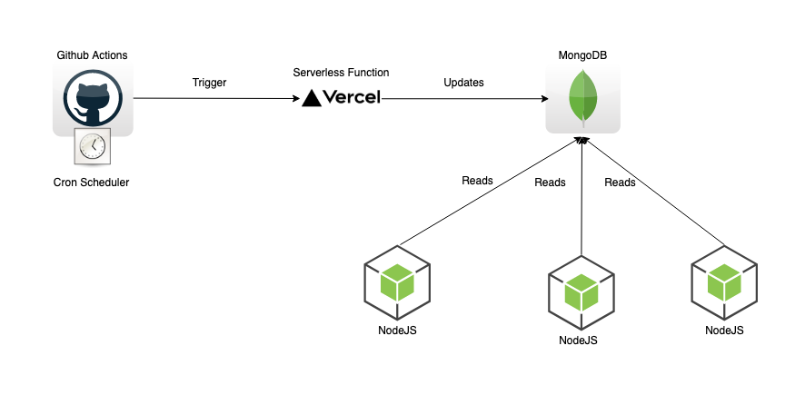

# [InvestoBull][investobull] – A Stock Price Prediction WebApp

## 1. Project Description

InvestoBull is a web app designed for everyday investors who struggle with the intricacies of the stock market. This app not only provides insights into the fundamentals of blue chip stocks in the Nasdaq alongside relevant news articles, but also provides stock price predictions powered by an ensemble of delicately tuned machine learning algorithms, to help investors make informed decisions. We do the heavy lifting so that our investors can enjoy their new-found financial freedom.

**Quick links: [Quick Start Guide][guide] | [Swagger API Documentation][swagger]**

### Tech Stack

[React](https://reactjs.org/) | [ChakraUI](https://chakra-ui.com/) | [Axios](https://axios-http.com/) | [Node](https://nodejs.org/) | [Express](https://expressjs.com/) | [MongoDB](https://www.mongodb.com/) | [Firebase][firebase] | [Stripe][stripe] | [Azure ML][azure-ml] | [Swagger](https://swagger.io/)

### Contents

-   [1. Project Description](#1-project-description)
-   [2. Requirements and Goals](#2-requirements-and-goals)
-   [3. Integration of Tech](#3-integration-of-tech)
-   [4. Above and Beyond](#4-above-and-beyond)
-   [5. Next Steps](#5-next-steps)
-   [6. Contributions](#6-contributions)

 

---

## 2. Requirements and Goals

### Minimal Requirements

-   ✅ Fully functional webapp that integrates all technologies learned throughout the course
-   ✅ Home page with a table containing at least 10 stocks
-   ✅ Retrieve stock details through an API and store stock data on MongoDB
-   ✅ Display fundamentals for each stock - market cap, earning etc.
-   ✅ Hard code stock predictions in our database as our MVP
-   ✅ News page that shows articles relevant to the financial market
-   ✅ Deploy the webapp on Vercel

### Standard Goals

-   User Accounts
    -   ✅ Secure authentication with email and Google, ability to reset password
    -   ✅ Persistent watchlist for each user
    -   ✅ Watchlist-specific news in the News page
    -   ✅ Basic in-app notification system
    -   ✅ Different tiers of subscription plans
    -   ✅ Secure credit card payment through Stripe
-   Stock Details
    -   ✅ Render an interactive graph using historical price fluctuation
    -   ✅ Display relevant news for each stock
    -   ⚠️ Breakdown of all variables used for future price predictions
-   User Interface
    -   ✅ Clean and consistent UI with high readability
    -   ✅ Responsive UI that is mobile ready

### Stretch Goals

-   Real-time Data
    -   ✅ Setup cron jobs on GitHub Actions to retrieve and update the MongoDB database with real-time stock data such as latest price and volume from [Alpha Vantage][alpha-vantage]
    -   ✅ Utilize cron jobs to fetch the latest news articles from [News API][newsapi]
-   User Experience
    -   ✅ Light and Dark mode to improve accessibility
    -   ✅ Loading spinners and responsive buttons to indicate interactive components
    -   ✅ Drag-and-drop functionality to maximize user customization
    -   ✅ Perform User Acceptance Testing with potential users/customers, and improve user flow based on feedback
-   Stock Price Predictions
    -   ✅ Integrate AutoML to deploy models as endpoints
    -   ✅ Have predictions set up for more than 10 stocks
    -   ⚠️ Graph detailed metrics related to each stock - moving averages, RS, RSI values etc.
    -   ⚠️ Set up in-app notifications to alert users on price fluctuations
    -   ❌ Send emails to alert users on important updates
    -   ❌ Analyze technical factors like moving averages, etc. for tuning and validating machine learning algorithms
    -   ❌ Display public reports from analyzers
-   Documentation
    -   ✅ [Quick Start Guide][guide]
    -   ✅ [Document API endpoints on Swagger][swagger]

 

---

## 3. Integration of Tech

### Unit 1 - HTML, CSS, JS

-   Used Chakra UI: a CSS framework, and styled using inline CSS
-   Built a Responsive UI for mobile view
-   Went above and beyond by designing cron jobs using Javascript to fetch realtime stock data

### Unit 2 - React

-   Used React to build reusable components to set up the website
    -   These components helped minimize code repetition and maximize re-usability
    -   The stateful components and virtual dom structure significantly reduces page load times and eliminates unnecessary updates
    -   React prevents DOM injection attacks
-   Used Context API to track state
    -   Eliminates the need for passing state as props
    -   Less boiler plate code compared to Redux
-   Used custom hooks for abstract site functionality
    -   Create reusable functions and avoid code duplication
-   Use Stripe Elements integration to handle credit card payments
    -   Eliminates the need to handle critical credit card data
-   Used React-firebase integration for authentication and storing user data
    -   Eliminates the need for building a custom OAuth solution
    -   Enhances security of the overall application
    -   onSnapshot event listener makes it easy to update React state when the firestore database is updated

### Unit 3 - Node & Express

-   Set up APIs using Express for
    -   Getting stock data
    -   Getting price prediction for stocks
    -   Handling credit card payment
    -   Getting stock news
-   Used Axios to make calls to the backend
    -   Supported in more browsers compared to fetch – even older ones
    -   Great documentation and better code readability

### Unit 4 - NoSQL with MongoDB

-   Built a future proof, scalable schema design in MongoDB Atlas to store the following:
    -   Real-time stock data
    -   Quarterly stock data
    -   Price fluctuation graphs data for a stock
    -   Predicted future price for stocks
    -   Stock-specific news
    -   News information from different news sources
-   Went above and beyond by integrating Cloud Firestore, a MongoDB fork hosted on Firebase, to store:
    -   User data – name, email, photo, plan, etc.
    -   Collections of user-specific Watchlist stocks, Notifications, and successful Payments

Storing data on Firestore allowed us to store all user related data on Firebase, enhancing integration with the authentication system

#### Why is NoSQL more suitable than SQL for our project?

-   It eliminates the need for determining relations between tables
-   Lower latency when reading / writing to large databases
-   Minimal data holes since data is stored as a JSON
-   Better horizontal scaling capacity for future-proofing

### Unit 5 - Release Engineering

-   Deployed the website on Vercel
    -   Higher performance with lower latency compared to Heroku (for free plans)
    -   Bigger free-tier plan for projects compared to other bigger hosting platforms like AWS, Azure, GCP etc.
-   Went above and beyond by deploying cron jobs on GitHub actions
    -   These trigger serverless functions set up on Vercel to pull in the latest stocks, news, and prediction data

 

---

## 4. Above and Beyond

### [Microsoft Azure AutoML](https://azure.microsoft.com/en-ca/services/machine-learning/automatedml/#features)

-   Azure ML and AWS SageMaker both provide anomaly detection, but we decided to use Azure as Microsoft offers free credits ($250) for students
-   Well documented interactive portal, CLI or Python Notebooks to train and deploy models
-   Offers easy to use and intuitive functionality for time series forecasting, that be tuned to a high degree of sophistication
-   Supports classification, regression, and time series forecasting
-   Easily manage and scale your resources all in one platform
-   Predictions use real-time stock data and queries Azure daily for updated predictions

### Cron Jobs

-   Leveraged Javascript to update stock, news and prediction information present in our system
-   Triggered by scheduler attached to Github actions which triggers serverless functions in Vercel to parse latest data

### Third-party Services

#### [Firebase][firebase]

-   [Firebase Authentication](https://firebase.google.com/products/auth)
    -   A simple yet secure way of setting up OAuth – no need to reinvent the wheel
    -   Seamless integration for email + Google Account login or signup
    -
-   [Cloud Firestore](https://firebase.google.com/products/firestore)
    -   Storing user data – name, subscription plan, watchlist, notifications, etc.
    -   Removes the need to move user data out of Firebase
    -   Inbuilt Listeners like onSnapshot update the state of the website in real time when changes are made to a collection

#### [Stripe][stripe]

-   Seamless way to process Credit Card payments
-   Reduces security concerns by eliminating the need to store credit card information
-   Easy integration into the website using stripe elements

#### [NewsAPI][newsapi]

-   Used NewsApi to fetch real-time news data corresponding not only to individual stocks but also to different news sources
-   Provides the right balance between news sources available and the size of the free plan. [Learn more][newsapi-comparison]

#### [Alpha Vantage API][alpha-vantage]

-   Used the Alpha Vantage API to fetch real-time data for different stocks
-   Most stock data APIs provide similar data but Alpha Vantage had really clean documentation

#### [Chart.js][chartjs]

-   Used Chart.js to render a reactive open/close chart with real-time data stored on our database

#### [react-beautiful-dnd][react-beautiful-dnd]

-   Used react-beautiful-dnd to enable the drag-and-drop functionality for the news cards

### User Acceptance Testing (UAT)

-   Performed UAT with 20+ potential users, where we make observations on each user's workflow
-   Addressed UI / UX concerns - color scheme, setting up light/dark mode, loading spinner, etc.

### Future-proofing

#### MongoDB structure

-   The MongoDB structure has been designed to handle new markets like TSX and NYSE if we decide to scale up in the future
-   Workflows have been set up to add new stocks without going into the database

### Documentation

#### [Quick Start Guide][guide]

-   Helps new users navigate through the webapp

#### [Swagger API Documentation][swagger]

-   Clean way to test and document endpoints our API endpoints
-   Interface to interact with APIs

 

---

## 5. Next Steps

-   Find alternative to the free API plan which currently only allows updating data for only 5 stocks a minute
-   Set up in app notifications for price fluctuations alerts that can be pre-set by the user
-   Send email alerts with important updates similar to newsletters
-   Analyze technical factors like moving averages for fine-tuning our algorithms
-   Display reports from reputed stock analysts
-   Automatically train machine learning models by creating a workflow to download and clean data

 

---

## 6. Contributions

#### Himanshu Goyal

-   Developed a responsive front-end for Home, Stock Details, Plans and parts of About Us, including interactive graphs and credit card payment section
-   Took leadership on setting up a scalable and future proof MongoDB schema along with backend integration and Swagger API documentation for stock details and news
-   Deployed the project on Vercel and set up the cron jobs to update real time data
-   Coordinated and scheduled meetings alongside text updates for smooth flow of the project

#### Paul Freiwirth

-   Developed the front-end for the news page, including a news filtering system
-   Set up the drag-and-drop functionality to enhance user experience
-   Worked on making the news page responsive

#### Raghav Thakur

-   Worked on stock predictions, Microsoft Azure AutoML integration with backend
-   Trained and deployed machine learning models using historical data of Nasdaq stocks
-   Initial development of frontend components such as Home and Stock Table, and created Quick Start Guide

#### Weiyoung Tan

-   Set up the login, signup, and password reset system using Firebase Authentication and stored user data on Cloud Firestore
-   Built the Navbar, Watchlist, Notifications, Payment Popups, and About Us components, and integrated user accounts with Payments, Notifications, and Watchlist
-   Took charge of the overall UI/UX, performed UAT with potential customers, structured README doc, helped out with Vercel deployment and cron jobs

 

[investobull]: https://investobull.vercel.app/
[guide]: https://drive.google.com/file/d/1XGfFeO6v_aEfeBdAqSZux_9Bni-dOc9I/view?usp=sharing
[swagger]: https://app.swaggerhub.com/apis-docs/InvestobullInvestors/InvestobullInvestors/1.0.0
[azure-ml]: https://azure.microsoft.com/en-ca/services/machine-learning/
[firebase]: https://firebase.google.com/
[stripe]: https://stripe.com/
[newsapi]: https://newsapi.org/
[alpha-vantage]: https://www.alphavantage.co/
[newsapi-comparison]: http://rapidapi.ca/blog/rapidapi-featured-news-apis/
[chartjs]: https://www.chartjs.org/
[react-beautiful-dnd]: https://github.com/atlassian/react-beautiful-dnd
[cron-workflow]: https://drive.google.com/file/d/1aKen6Y5VnhOW3yXCGJ1H2mRckcYLeYsg/view?usp=sharing
